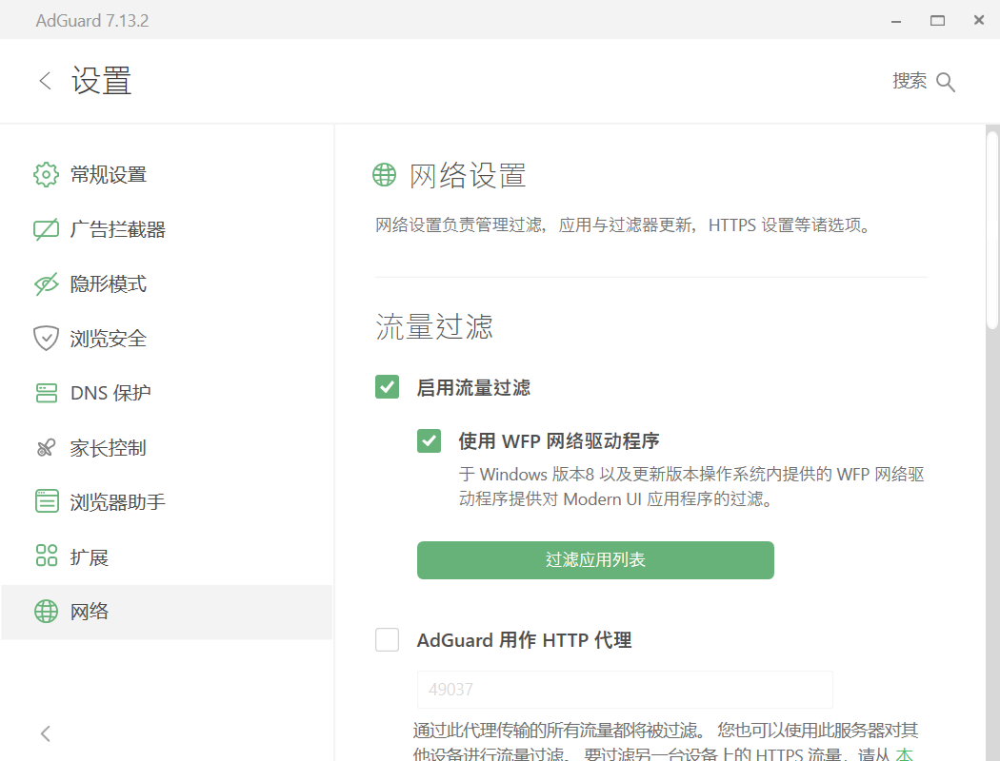
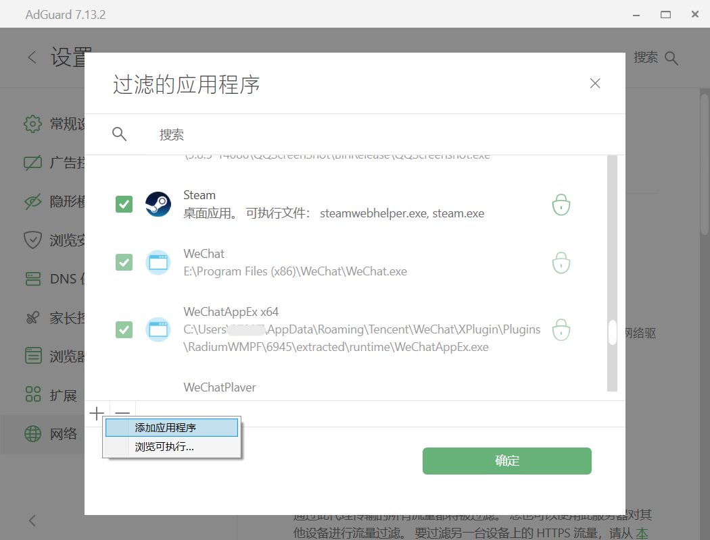
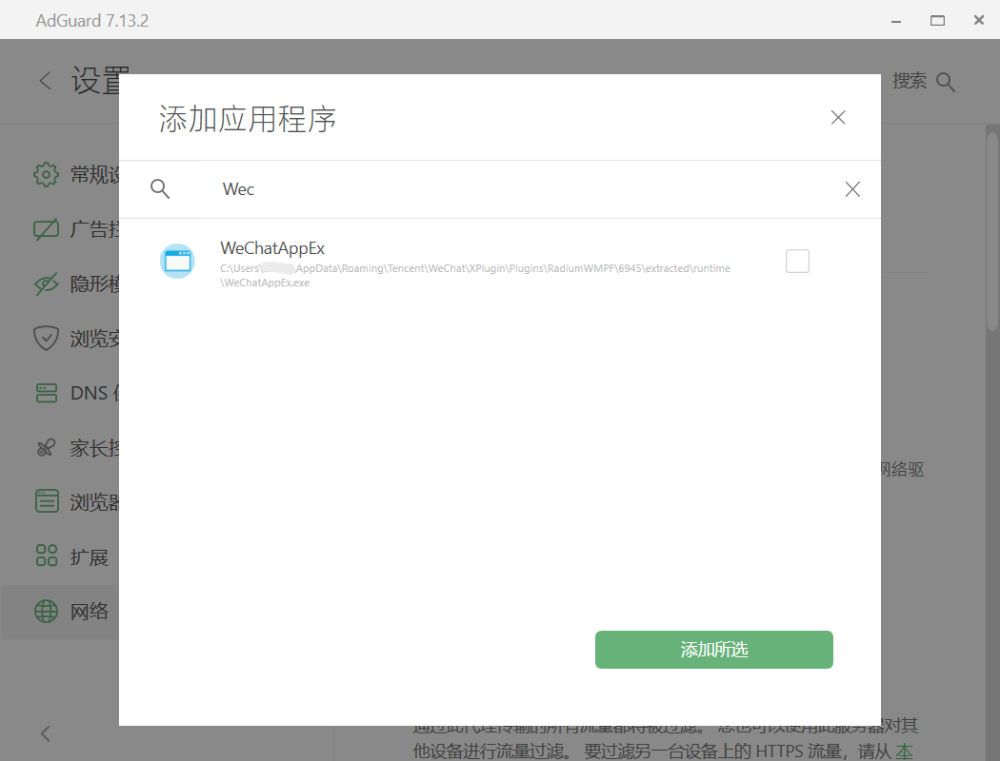
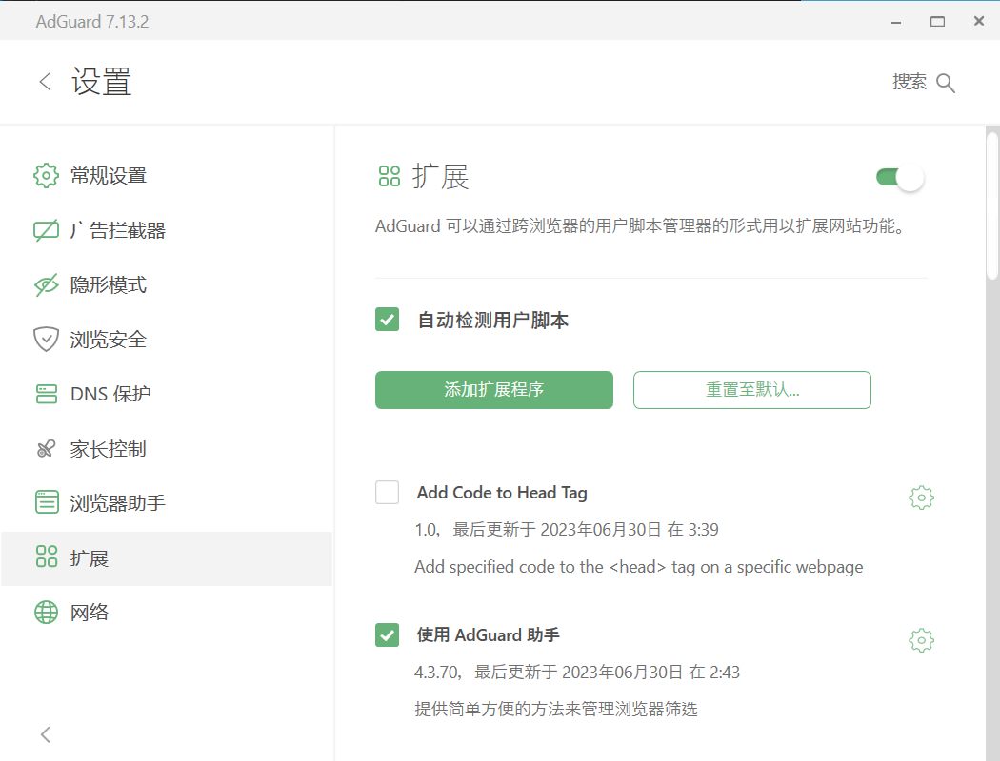
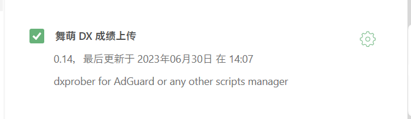

# dxprober_for_adguard

## 配合 AdGuard 食用的舞萌 DX 查分器数据导入扩展（for Android and Windows) 
❗iOS 设备如果有相同需求推荐 [realZnS/dxprober.js](https://github.com/realZnS/dxprober.js)，本脚本理论上可以在 AdGuard for iOS 上运行，但不能保证运行效果

|Windows|Android|
| :-----------: | :-----------: |
|||

## 需求

- 舞萌 DX 查分器账户
- 安装 AdGuard 且能流畅运行微信的设备
- Android 设备需要拥有 ROOT 权限（需要将 AdGuard 的证书移入系统证书存储区）

## 限制

- Android 设备需要拥有 ROOT 权限（需要将 AdGuard 的证书移入系统证书存储区）
> 为了使应用更容易控制对其安全网络流量的访问，对于 API 级别为 24 及以上的应用，由用户安装的证书颁发机构以及通过 Device Admin API 安装的证书颁发机构在默认情况下不再受信任。

- AdGuard 和其他代理软件配合使用需要一定的设置
- AdGuard 为付费软件，免费用户功能会受到一定限制

## 使用指南

### 准备

从源代码或 Release 直接下载 dxprober_for_adguard.user.js，并将末尾处的 USERNAME 和 PASSWORD 改为查分器账户的用户名和密码

加速链接：https://raw.iqiq.io/walkonbothsides/dxprober_for_adguard/main/dxprober_for_adguard.user.js

### Android 端

安装 AdGuard for Android 后会引导你安装 HTTPS 证书，但此时证书位于用户证书区不被微信信任（AdGuard 默认也会关闭微信的 HTTPS 过滤），我们需要刷入 AdGuard Certificate 的 Magisk 模块来移动证书。

模块链接：https://github.com/AdguardTeam/adguardcert/releases/latest/

安装完成后重启设备，打开微信的 HTTPS 过滤即可。

### Windows 端
安装 AdGuard for Windows 后默认会自己安装根证书并开始 HTTPS 过滤，我们需要将微信浏览器的进程加入 AdGuard 的过滤应用列表。

已知微信浏览器的进程名为 WeChatAppEx.exe，可直接搜索添加。

在同页面的扩展处导入已经下载和调整后的脚本并启用即可

